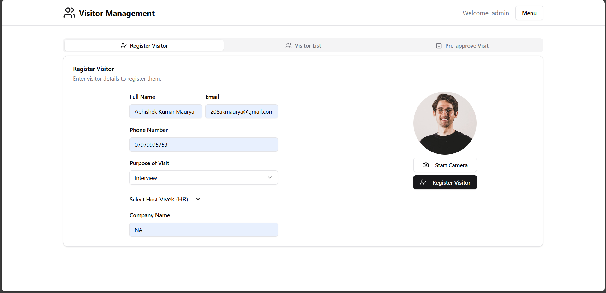
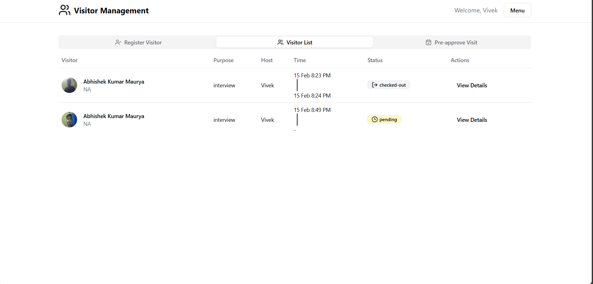
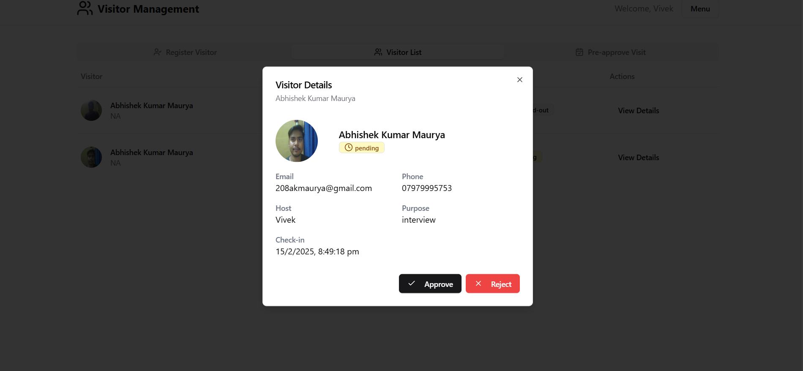
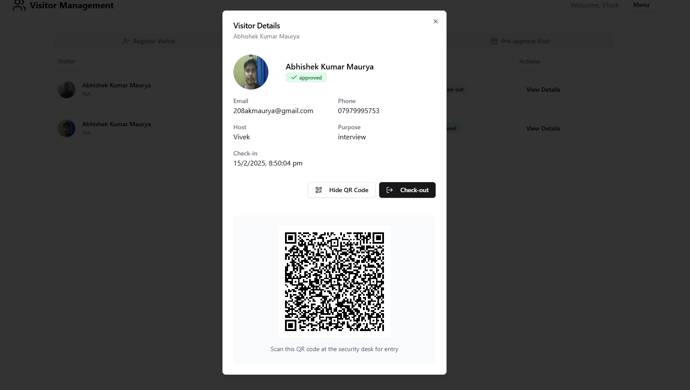

# Visitor Management System Documentation

## Project Setup Guide

### Installation
1. Ensure you have Node.js (v14+) installed.
2. Clone the repository: `git clone git@github.com:Abhishek-Maurya2/Visitor-Management-System.git`
3. Navigate to the project directory: `cd /c:/Users/Abhishek/Desktop/a/Visitor`
4. Install dependencies: `npm install`

### Development
- Start the development server: `npm run dev`
- Visit [http://localhost:5173](http://localhost:5173) in your browser.
- Hot Module Replacement (HMR) ensures real-time changes.

### Production Build
- Create a production build: `npm run build`
- Optionally serve the build: `npm run serve`

## Overview
Visitor Management System is a comprehensive solution built with React and Vite to streamline visitor tracking and management within organizations. It offers a user-friendly interface with real-time updates via Hot Module Replacement (HMR).

## Architecture
- **Frontend:** React for building interactive UI components.
- **Bundler:** Vite for a fast development experience and efficient production builds.
- **Linting:** ESLint to ensure code quality and consistency.

## Features
- Log visitor check-in/check-out.
- Real-time status updates.
- Dashboard displaying visitor statistics.
- Role-based access control.

## Screenshots

Below are some screenshots of key features.

*Registeration form to get approval for visit.*

*After the registeration is done a request is logged in table.*

  
*Reuqest to approve invitation is sent to host.*

  
*After the approval a QR Code is generated for the visitor.*

## Technology Stack
- React
- Vite
- ESLint
- JavaScript
- Tailwindcss
- Zustand

## Usage
1. Clone the repository.
2. Install dependencies with `npm install`.
3. Run in development mode: `npm run dev`.
4. Login as admin or register as a employee (host)
5. Create a Visit request or Invite visitors

## Contribution
Contributions are welcome. Please refer to the contribution guidelines in the repository for more details.

## FAQ
- **How do I report an issue?**  
  Open an issue in the repository.
- **How can I contribute?**  
  Fork the repository, create a branch for your feature or fix, and submit a pull request.
